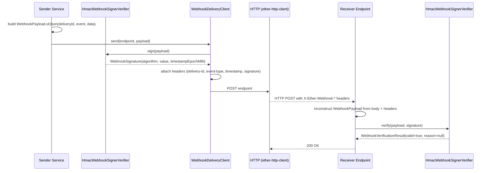

# ether-webhook

Webhook signing, verification, and delivery for the ether ecosystem. Built on `ether-http-client` and `ether-json`. Provides HMAC-SHA256 request signing, constant-time signature verification, structured payload building, and a delivery client that handles the HTTP POST with correct headers.

## Coordinates

```xml
<dependency>
    <groupId>dev.rafex.ether.webhook</groupId>
    <artifactId>ether-webhook</artifactId>
    <version>8.0.0-SNAPSHOT</version>
</dependency>
```

Runtime transitive dependencies:

```xml
<dependency>
    <groupId>dev.rafex.ether.http</groupId>
    <artifactId>ether-http-client</artifactId>
</dependency>
<dependency>
    <groupId>dev.rafex.ether.json</groupId>
    <artifactId>ether-json</artifactId>
</dependency>
```

---

## Package overview

| Package | Purpose |
|---|---|
| `dev.rafex.ether.webhook.api` | `WebhookSigner` and `WebhookVerifier` interfaces |
| `dev.rafex.ether.webhook.crypto` | `HmacWebhookSignerVerifier` — HMAC-SHA256 implementation |
| `dev.rafex.ether.webhook.model` | `WebhookPayload`, `WebhookSignature`, `WebhookVerificationResult` |
| `dev.rafex.ether.webhook.client` | `WebhookDeliveryClient` — delivers signed webhooks via HTTP POST |
| `dev.rafex.ether.webhook.headers` | `WebhookHeaders` — standard header name constants |

---

## How signing works

The canonical payload signed by `HmacWebhookSignerVerifier` is a newline-joined string:

```
{deliveryId}\n{eventType}\n{contentType}\n{timestampEpochMilli}\n{base64url(body)}
```

The HMAC-SHA256 of that string is then base64url-encoded (no padding) and placed in `WebhookSignature.value()`. The same function runs on the receiver side and the two signatures are compared with `MessageDigest.isEqual()` (constant-time comparison — safe against timing attacks).

---

## Architecture: sign → deliver → verify



---

## Standard HTTP headers

`WebhookHeaders` provides the constant header names used in every delivery:

| Constant | Header name | Value example |
|---|---|---|
| `DELIVERY_ID` | `X-Ether-Webhook-Delivery-Id` | `"evt-001"` |
| `EVENT_TYPE` | `X-Ether-Webhook-Event-Type` | `"user.created"` |
| `TIMESTAMP` | `X-Ether-Webhook-Timestamp` | `"1742300000000"` (epoch ms) |
| `ALGORITHM` | `X-Ether-Webhook-Algorithm` | `"HmacSHA256"` |
| `SIGNATURE` | `X-Ether-Webhook-Signature` | base64url-encoded HMAC |
| `CONTENT_TYPE` | `X-Ether-Webhook-Content-Type` | `"application/json"` |

---

## WebhookPayload

`WebhookPayload` is an immutable record carrying everything needed to sign and deliver:

```java
public record WebhookPayload(
    String deliveryId,
    String eventType,
    Instant occurredAt,
    String contentType,
    byte[] body,
    Map<String, List<String>> headers
)
```

Factory helpers:

```java
// JSON payload (uses ether-json to serialize the object)
var payload = WebhookPayload.ofJson("evt-001", "user.created",
    Map.of("id", 42, "email", "alice@example.com"));

// Plain-text payload
var payload = WebhookPayload.ofText("evt-002", "health.check",
    "server=ok");

// Add custom headers (immutable — returns a new record)
var payload = WebhookPayload.ofJson("evt-003", "order.placed", orderData)
    .withHeader("X-Tenant-Id", "acme");
```

---

## Example: sign and deliver a webhook

```java
package com.example.webhook;

import dev.rafex.ether.webhook.client.WebhookDeliveryClient;
import dev.rafex.ether.webhook.crypto.HmacWebhookSignerVerifier;
import dev.rafex.ether.webhook.model.WebhookPayload;
import dev.rafex.ether.http.client.EtherHttpClient;
import java.net.URI;
import java.nio.charset.StandardCharsets;
import java.util.Map;

public final class WebhookSenderExample {

    public static void main(String[] args) throws Exception {
        var secret = "super-secret-key-change-in-production".getBytes(StandardCharsets.UTF_8);
        var signer = new HmacWebhookSignerVerifier(secret);
        var http   = EtherHttpClient.create(); // ether-http-client default
        var client = new WebhookDeliveryClient(http, signer);

        var payload = WebhookPayload.ofJson(
            "evt-001",          // deliveryId — must be unique per attempt
            "user.created",     // eventType
            Map.of(
                "id",    42,
                "email", "alice@example.com",
                "plan",  "pro"
            )
        );

        var endpoint = URI.create("https://receiver.example.com/hooks/user");
        var response = client.send(endpoint, payload);

        System.out.printf("Delivery status: %d%n", response.statusCode());
        // => 200 on success
    }
}
```

### Inspect the signed request before sending

```java
var request = client.buildRequest(endpoint, payload);
// request.headers() contains all X-Ether-Webhook-* headers
// request.body() contains the JSON bytes
```

---

## Example: verify an incoming webhook (receiver endpoint)

```java
package com.example.webhook;

import dev.rafex.ether.webhook.crypto.HmacWebhookSignerVerifier;
import dev.rafex.ether.webhook.headers.WebhookHeaders;
import dev.rafex.ether.webhook.model.*;
import java.nio.charset.StandardCharsets;
import java.time.Instant;
import java.util.List;
import java.util.Map;

/**
 * Demonstrates webhook verification inside an HTTP handler.
 * Adapt to your specific ether-http-core HttpExchange.
 */
public final class WebhookReceiverHandler {

    private final HmacWebhookSignerVerifier verifier;

    public WebhookReceiverHandler(byte[] sharedSecret) {
        this.verifier = new HmacWebhookSignerVerifier(sharedSecret);
    }

    public void handle(IncomingHttpRequest request) {
        // 1. Read all relevant headers from the incoming request
        var deliveryId  = request.header(WebhookHeaders.DELIVERY_ID);
        var eventType   = request.header(WebhookHeaders.EVENT_TYPE);
        var contentType = request.header(WebhookHeaders.CONTENT_TYPE);
        var algorithm   = request.header(WebhookHeaders.ALGORITHM);
        var sigValue    = request.header(WebhookHeaders.SIGNATURE);
        var tsStr       = request.header(WebhookHeaders.TIMESTAMP);

        if (sigValue == null || tsStr == null) {
            request.respond(400, "Missing webhook signature headers");
            return;
        }

        long timestampEpochMilli;
        try {
            timestampEpochMilli = Long.parseLong(tsStr);
        } catch (NumberFormatException e) {
            request.respond(400, "Invalid timestamp header");
            return;
        }

        // 2. Reconstruct the WebhookPayload from the raw body
        var payload = new WebhookPayload(
            deliveryId,
            eventType,
            Instant.ofEpochMilli(timestampEpochMilli),
            contentType != null ? contentType : "application/json",
            request.bodyBytes(),
            Map.of()
        );

        // 3. Reconstruct the WebhookSignature from headers
        var signature = new WebhookSignature(
            algorithm != null ? algorithm : "HmacSHA256",
            sigValue,
            timestampEpochMilli
        );

        // 4. Verify
        var result = verifier.verify(payload, signature);
        if (!result.valid()) {
            request.respond(401, "Invalid signature: " + result.reason());
            return;
        }

        // 5. Process the verified event
        System.out.printf("Verified event [%s] delivery=[%s]%n", eventType, deliveryId);
        request.respond(200, "Accepted");
    }
}
```

---

## Full sender service

A production sender service that wraps the delivery client and adds logging:

```java
package com.example.webhook;

import dev.rafex.ether.webhook.client.WebhookDeliveryClient;
import dev.rafex.ether.webhook.crypto.HmacWebhookSignerVerifier;
import dev.rafex.ether.webhook.model.WebhookPayload;
import dev.rafex.ether.http.client.EtherHttpClient;
import java.net.URI;
import java.nio.charset.StandardCharsets;
import java.util.UUID;
import java.util.logging.Logger;

public final class WebhookSenderService {

    private static final Logger LOG = Logger.getLogger(WebhookSenderService.class.getName());

    private final WebhookDeliveryClient client;

    public WebhookSenderService(String sharedSecret) {
        var secret = sharedSecret.getBytes(StandardCharsets.UTF_8);
        var signer = new HmacWebhookSignerVerifier(secret);
        var http   = EtherHttpClient.create();
        this.client = new WebhookDeliveryClient(http, signer);
    }

    /**
     * Fire a webhook for a domain event.
     *
     * @param endpointUrl  the receiver's HTTPS endpoint
     * @param eventType    e.g. "order.shipped"
     * @param eventData    any serializable object
     */
    public void fire(String endpointUrl, String eventType, Object eventData) {
        var deliveryId = UUID.randomUUID().toString();
        var payload = WebhookPayload.ofJson(deliveryId, eventType, eventData);

        try {
            var response = client.send(URI.create(endpointUrl), payload);
            int status = response.statusCode();
            if (status >= 200 && status < 300) {
                LOG.info("Webhook delivered: event=%s delivery=%s status=%d"
                    .formatted(eventType, deliveryId, status));
            } else {
                LOG.warning("Webhook rejected: event=%s delivery=%s status=%d"
                    .formatted(eventType, deliveryId, status));
                // Queue for retry (see retry section below)
            }
        } catch (Exception e) {
            LOG.severe("Webhook delivery failed: event=%s delivery=%s error=%s"
                .formatted(eventType, deliveryId, e.getMessage()));
            // Queue for retry
        }
    }
}
```

---

## Retry policy

`WebhookDeliveryClient.send()` performs a single HTTP POST. Retry logic belongs in the calling service. A simple exponential back-off pattern using Java 21 virtual threads or a scheduled executor:

```java
package com.example.webhook;

import dev.rafex.ether.webhook.client.WebhookDeliveryClient;
import dev.rafex.ether.webhook.model.WebhookPayload;
import java.net.URI;
import java.time.Duration;
import java.util.concurrent.Executors;
import java.util.concurrent.ScheduledExecutorService;
import java.util.concurrent.TimeUnit;
import java.util.logging.Logger;

public final class RetryingWebhookSender {

    private static final Logger LOG = Logger.getLogger(RetryingWebhookSender.class.getName());
    private static final int MAX_ATTEMPTS = 5;

    private final WebhookDeliveryClient client;
    private final ScheduledExecutorService scheduler =
        Executors.newSingleThreadScheduledExecutor();

    public RetryingWebhookSender(WebhookDeliveryClient client) {
        this.client = client;
    }

    public void send(URI endpoint, WebhookPayload payload) {
        attempt(endpoint, payload, 1);
    }

    private void attempt(URI endpoint, WebhookPayload payload, int attemptNumber) {
        try {
            var response = client.send(endpoint, payload);
            if (response.statusCode() >= 200 && response.statusCode() < 300) {
                LOG.info("Delivered on attempt " + attemptNumber);
                return;
            }
        } catch (Exception e) {
            LOG.warning("Attempt %d failed: %s".formatted(attemptNumber, e.getMessage()));
        }

        if (attemptNumber >= MAX_ATTEMPTS) {
            LOG.severe("Giving up after %d attempts for delivery=%s"
                .formatted(MAX_ATTEMPTS, payload.deliveryId()));
            return;
        }

        // Exponential back-off: 1s, 2s, 4s, 8s ...
        long delaySeconds = (long) Math.pow(2, attemptNumber - 1);
        scheduler.schedule(
            () -> attempt(endpoint, payload, attemptNumber + 1),
            delaySeconds,
            TimeUnit.SECONDS
        );
    }
}
```

---

## Custom signer/verifier

You can implement `WebhookSigner` and `WebhookVerifier` separately or together if you need a different algorithm:

```java
package com.example.webhook;

import dev.rafex.ether.webhook.api.WebhookSigner;
import dev.rafex.ether.webhook.model.*;
import java.time.Instant;
import java.util.UUID;

/**
 * A no-op signer for testing — never use in production.
 */
public final class NoOpWebhookSigner implements WebhookSigner {

    @Override
    public WebhookSignature sign(WebhookPayload payload) {
        return new WebhookSignature("none", UUID.randomUUID().toString(),
            Instant.now().toEpochMilli());
    }
}
```

---

## WebhookVerificationResult

`WebhookVerificationResult` is a record with three fields:

| Field | Type | Meaning |
|---|---|---|
| `valid` | `boolean` | `true` when signature matched |
| `reason` | `String` | `null` on success; one of `"missing_signature"`, `"unsupported_algorithm"`, `"bad_signature"` on failure |
| `signature` | `WebhookSignature` | The signature that was evaluated (may be `null` for `missing_signature`) |

```java
var result = verifier.verify(payload, signature);
if (result.valid()) {
    // process
} else {
    switch (result.reason()) {
        case "missing_signature"    -> respond(400, "No signature");
        case "unsupported_algorithm"-> respond(400, "Algorithm not supported");
        case "bad_signature"        -> respond(401, "Signature mismatch");
        default                     -> respond(401, "Verification failed");
    }
}
```

---

## License

MIT License — Copyright (c) 2025–2026 Raúl Eduardo González Argote
